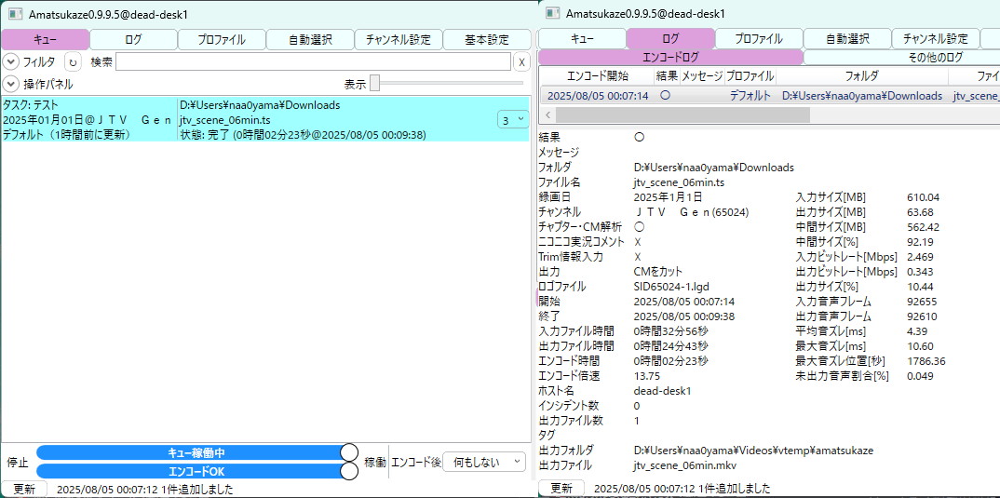

# JTV Gen - Japanese TV Content Generator

日本のテレビ放送に擬似したダミーファイルを作成するプロジェクトです。

## 概要

JTV Gen は、日本のテレビ放送規格に準拠した MPEG-TS 形式のダミー放送ファイルを生成するツールです。メインプログラム、CM、メタデータを含む完全な放送ストリームを作成できます。

## 主な機能

- 🎥 **本編セグメント生成** - ロゴ付きテストパターンでメインコンテンツを生成
- 📺 **CM セグメント生成** - 15秒間隔の日本の放送基準に準拠した CM セグメント
- 🔇 **無音区間** - CM の前後に色反転を伴う無音区間を自動挿入
- 📡 **PSI/SI メタデータ** - EIT、SDT、TOT を含む完全な放送メタデータ
- ⚙️ **設定可能な構成** - CSV 形式の設定ファイルで番組構成をカスタマイズ
- 🎚️ **音声レベル準拠** - 日本の放送基準に準拠した音声レベル（-20dBFS for 0VU）

## 技術仕様

- **映像**: MPEG-2, 1440x1080, 16:9, 29.97fps **Progressive**
- **音声**: AAC-LC (MPEG-4), 48kHz, ステレオ, 248kbps
- **コンテナ**: MPEG-TS（適切なストリーム ID 付き）
- **規格**: ARIB 準拠（日本の地上デジタル放送）

> [!IMPORTANT]
> 日本のテレビ放送の映像は MPEG-2 1440x1080 [SAR 4:3 DAR 16:9] 29.97fps interlaced の映像ですが、ロゴ解析が機能する品質にするにはかなり高いビットレートと生成時間を必要としたため見送っています。  
> また音声についても厳密には MPEG-2 AAC LC でなければなりませんが fdk-aac などライセンス問題で利用が限られる可能性があるため MPEG-4 AAC LC で代用しています。

## システム要件

- **FFmpeg** - MPEG-2 および AAC エンコーディング対応
- **TSDuck** - PSI/SI メタデータ注入用（3.41 以降）
- **bc** - 持続時間計算用
- **Unix ツール** - grep, awk, md5sum, jq など

## インストール

### TSDuck のインストール

Ubuntu 24.04 LTS の場合：

```bash
# 最新リリースをダウンロード
wget "https://github.com/tsduck/tsduck/releases/latest/download/tsduck_*.deb"
sudo apt --fix-broken install "./tsduck_*.deb"

```

その他のディストリビューション：

https://tsduck.io/download/tsduck/

### その他の依存関係

Ubuntu/Debian：

```bash
sudo apt update
sudo apt install ffmpeg bc jq fonts-ubuntu

```

## 使用方法

### 基本的な使用方法

```bash
## 適当な Linux 環境で
curl -o jtv_gen.sh -sfSL https://raw.githubusercontent.com/naa0yama/jtv-gen/refs/heads/main/jtv_gen.sh
chmod +x jtv_gen.sh

# デフォルト設定で生成
./jtv_gen.sh

# デバッグモードで実行
./jtv_gen.sh --debug

# カスタム設定ファイルを使用
./jtv_gen.sh -c custom_scene.conf

# 確認をスキップして自動実行
./jtv_gen.sh --debug -c scene_06min.conf -y

```

[rigaya/Amatsukaze](https://github.com/rigaya/Amatsukaze) で映像データが認識できることを目標に製作したため、 `./jtv_gen.sh --debug -c scene_30min.conf -y` などで若干長尺の映像を出し、ロゴ登録をすることで CM カットのテストをすることも可能です。



<details>
<summary>実行したログのサンプル</summary>

```bash
./jtv_gen.sh -y
=== JTV Gen Started ===
Timestamp: Tue Aug  5 12:02:38 AM JST 2025
Checking system dependencies and capabilities
Verifying FFmpeg codec and filter support
Warnings - Some features may be limited:
  - MPEG-2 video codec may not be available
  - AAC audio codec may not be available
  - drawtext filter for text overlay may not be available
  - Ubuntu font (install with: sudo apt install fonts-ubuntu) may not be available
Script will attempt to run with available codecs/filters
✓ All dependencies available
✓ FFmpeg version: 6.1.1-3ubuntu5
✓ All required codecs and filters available
Loading configuration from scene_06min.conf
Loaded 10 segments and 19 configuration parameters
Preparing temporary directories
Generating comprehensive PSI/SI tables
Generated comprehensive PSI/SI tables:
  PAT:         temp/pat.xml (Program Association Table)
  NIT:         temp/nit.xml (Network Information Table)
  SDT:         temp/sdt.xml (Service Description Table)
  EIT:         temp/eit.xml (Event Information Table)
  TOT:         temp/tot.xml (Time Offset Table)
  PMT:         temp/pmt.xml (Program Map Table)
=== Media Configuration Preview ===
Configuration: scene_06min.conf
Output:        output/scene_06min/jtv_scene_06min.ts

Video:         MPEG-2, progressive, 1440x1080 [SAR 4:3, DAR 16:9]
               30000/1001 fps, bitrate min 1M, avg 6M, maxrate 12M
Audio:         aac, 48000Hz, 2ch, 248k
Duration:      00:06:00 (10793 frames)
Broadcast:     Service ID 65024, Transport Stream ID 10153
               Service: "JTV Gen" by "FFmpeg"
               Network: "Generated by naa0yama"
EIT Metadata:  Start time 2024-12-31 15:00:00 UTC, Present/Following enabled

=== Segment Structure Preview ===
SECTION_TYPE    SECTION_NAME         START_FRAME  END_FRAME    FRAME_COUNT  TIMESTAMP                
============    ============         ===========  =========    ===========  =======================  
Main            Main_1               0            1198         1199         00:00:00.00 - 00:00:39.29 ( 39.973s)
CM              CM1-1                1199         2097         899          00:00:40.00 - 00:01:09.29 ( 29.963s)
Main            Main_2               2098         7191         5094         00:01:10.00 - 00:03:59.28 (169.936s)
CM              CM2-1                7192         7641         450          00:03:59.29 - 00:04:14.29 ( 14.982s)
CM              CM2-2                7642         8540         899          00:04:14.30 - 00:04:44.29 ( 29.963s)
CM              CM2-3                8541         8990         450          00:04:44.30 - 00:04:59.29 ( 14.982s)
CM              CM2-4                8991         9439         449          00:04:59.30 - 00:05:14.28 ( 14.948s)
CM              CM2-5                9440         9888         449          00:05:14.29 - 00:05:29.28 ( 14.948s)
CM              CM2-6                9889         10338        450          00:05:29.29 - 00:05:44.28 ( 14.982s)
CM              CM2-7                10339        10793        455          00:05:44.29 - 00:06:00.04 ( 15.148s)

Auto-confirmed with -y option. Starting generation...
Generating individual segments
Using 4 parallel jobs (CPU cores: 60)
Processing 10 segments asynchronously
Overall: 001/010 (010.00%)
Completed: CM2-2
Overall: 002/010 (020.00%)
Completed: CM1-1
Overall: 003/010 (030.00%)
Completed: Main_1
Overall: 004/010 (040.00%)
Completed: CM2-6
Overall: 005/010 (050.00%)
Completed: CM2-7
Overall: 006/010 (060.00%)
Completed: CM2-1
Waiting for remaining jobs to complete...
Overall: 007/010 (070.00%)
Completed: CM2-3
Overall: 008/010 (080.00%)
Completed: CM2-5
Overall: 009/010 (090.00%)
Completed: CM2-4
Overall: 010/010 (100.00%)
Completed: Main_2
All 10 segments generated successfully
Concatenating segments to intermediate output
Found 10 segment files to concatenate
Intermediate output created: temp/scene_06min/jtv_scene_06min.ts
Injecting comprehensive PSI/SI metadata
Compiling PSI/SI tables
Compiling pat.xml
✓ pat.bin compiled successfully
Compiling pmt.xml
✓ pmt.bin compiled successfully
Compiling nit.xml
✓ nit.bin compiled successfully
Compiling sdt.xml
✓ sdt.bin compiled successfully
Compiling eit.xml
✓ eit.bin compiled successfully
Compiling tot.xml
✓ tot.bin compiled successfully
Injecting PSI/SI tables
✓ pat.bin ready for injection
✓ pmt.bin ready for injection
✓ nit.bin ready for injection
✓ sdt.bin ready for injection
✓ eit.bin ready for injection
✓ tot.bin ready for injection
Starting injection with 6 tables
Using comprehensive PSI/SI injection
Executing: tsp --japan --add-input-stuffing 1/25 -I file "temp/scene_06min/jtv_scene_06min.ts" -P inject "temp/scene_06min/pat.bin" --pid 0 --replace -P inject "temp/scene_06min/nit.bin" --pid 16 --inter-packet 250 -P inject "temp/scene_06min/sdt.bin" --pid 17 --replace -P inject "temp/scene_06min/eit.bin" --pid 18 --inter-packet 250 -P inject "temp/scene_06min/tot.bin" --pid 20 --inter-packet 2500 -P inject "temp/scene_06min/pmt.bin" --pid 257 --replace -P continuity --fix -O file "temp/scene_06min/jtv_scene_06min_with_metadata.ts"
'temp/scene_06min/jtv_scene_06min_with_metadata.ts' -> 'temp/scene_06min/jtv_scene_06min.ts'
Optimized PSI/SI metadata injection completed successfully
Analyzing injected tables:
|  First TOT local time stamp: ......................... 2025/01/01 09:00:00  |
|  Last TOT local time stamp: .......................... 2025/01/01 09:00:00  |
|  TOT country code: ................................................... JPN  |
|  0x0011  SDT/BAT ...................................... C        3,177 b/s  |
|  0x0012  EIT .......................................... C       10,338 b/s  |
|  0x0014  TDT/TOT ...................................... C        1,036 b/s  |
|  PID: 0x0011 (17)                                                  SDT/BAT  |
|  PID: 0x0012 (18)                                                      EIT  |
|  PID: 0x0014 (20)                                                  TDT/TOT  |
|  PID: 0x0011 (17)                                                  SDT/BAT  |
|  0x42 (66, SDT Actual), TID ext: 0x27A9 (10153)                             |
|  PID: 0x0012 (18)                                                      EIT  |
|  0x4E (78, EIT p/f Actual), TID ext: 0xFE00 (65024)                         |
|  PID: 0x0014 (20)                                                  TDT/TOT  |
|  0x73 (115, TOT)                                                            |
✓ EIT table detected - event information should be available
✓ TOT table detected - time information should be available
Moving final output to destination
Final output ready: output/scene_06min/jtv_scene_06min.ts(with EIT metadata) (106M)
Generating report
Report generated: output/scene_06min/generation_report.txt
CSV structure: output/scene_06min/segment_structure.csv
Technical verification:
Duration: 360.729867s, Size: 110249028 bytes, Bitrate: 2445021 bps
Verifying broadcast compatibility
PSI/SI structure verification:
pid:pid=17:access=clear:servcount=0:global:bitrate=3177:bitrate204=3447:packets=721:clear=721:scrambled=0:invalidscrambling=0:af=0:pcr=0:pts=0:dts=0:pcrleap=0:ptsleap=0:dtsleap=0:discontinuities=0:duplicated=0:unitstart=721:description=SDT/BAT
pid:pid=20:access=clear:servcount=0:global:bitrate=1036:bitrate204=1124:packets=235:clear=235:scrambled=0:invalidscrambling=0:af=0:pcr=0:pts=0:dts=0:pcrleap=0:ptsleap=0:dtsleap=0:discontinuities=0:duplicated=0:unitstart=235:description=TDT/TOT
Broadcast compatibility checks:
1. Service information:
    Service Id: 0xFE00 (65024), EITs: no, EITp/f: yes, CA mode: free
    - Descriptor 0: Service (0x48, 72), 18 bytes
      Service type: 0x01 (Digital television service)
2. Time information:
* TOT, TID 0x73 (115), PID 0x0014 (20)
1. Event information:
    - Event Id: 0x03E9 (1001)
      - Descriptor 0: Short Event (0x4D, 77), 48 bytes
        Event name: "JTV Gen Program"
Broadcast verification procedure:
  1. Check PSI/SI metadata injection
  2. Verify service information display
  3. Confirm the following are included:
     ✅ Genre information
     ✅ Resolution information
     ✅ Service name: JTV Gen
     ✅ Start time: 2024-12-31 15:00:00
Cleaning up temporary files
=== JTV Gen Completed ===

```

</details>

### オプション

- `--debug` - 詳細なデバッグ出力を有効化
- `-c, --config FILE` - 設定ファイルを指定（デフォルト: scene_06min.conf）
- `-y, --yes` - 確認プロンプトをスキップして即座に生成開始
- `-h, --help` - 詳細なヘルプメッセージを表示

## 設定ファイル形式

設定ファイルは CSV 形式で番組構成を定義します：

```text
# TV Program Configuration
# Format: SECTION_TYPE,SECTION_NAME,START_FRAME,END_FRAME
# SECTION_TYPE: RecMargin, Main, CM
# START_FRAME,END_FRAME: Frame range (29.97fps)

# Program Structure
SECTION_TYPE,SECTION_NAME,START_FRAME,END_FRAME
Main,Main_1,0,1000
CM,CM1-1,1001,1798

```

## 出力ファイル

生成されるファイル：

- `output/<CONFIG_BASE>/jtv_[config].ts` - 最終的な MPEG-TS 出力
- `output/<CONFIG_BASE>/generation_report.txt` - 詳細な生成レポート
- `output/<CONFIG_BASE>/segment_structure.csv` - セグメントタイミングデータ
- `tv_generation.log` - 生成ログファイル

## 中断処理

スクリプトは中断（Ctrl+C、SIGTERM）を適切に処理します：

- 実行中の ffmpeg プロセスを終了
- 一時ファイルを自動クリーンアップ
- 明確なステータスメッセージを表示

## デバッグ

デバッグモード（`--debug`）では：

- 詳細な処理ログを出力
- 一時ファイルを保持
- 各セグメントの処理状況を表示

## トラブルシューティング

### TSDuck が見つからない場合

```bash
# Ubuntu の場合
wget "https://github.com/tsduck/tsduck/releases/latest/download/tsduck_*.deb"
sudo apt install "./tsduck_*.deb"

```

### FFmpeg のコーデックエラー

- 完全な FFmpeg ビルドがインストールされていることを確認
- パッケージマネージャまたは公式ビルドを使用

## ライセンス

[AGPL-3.0 license](LICENSE)
